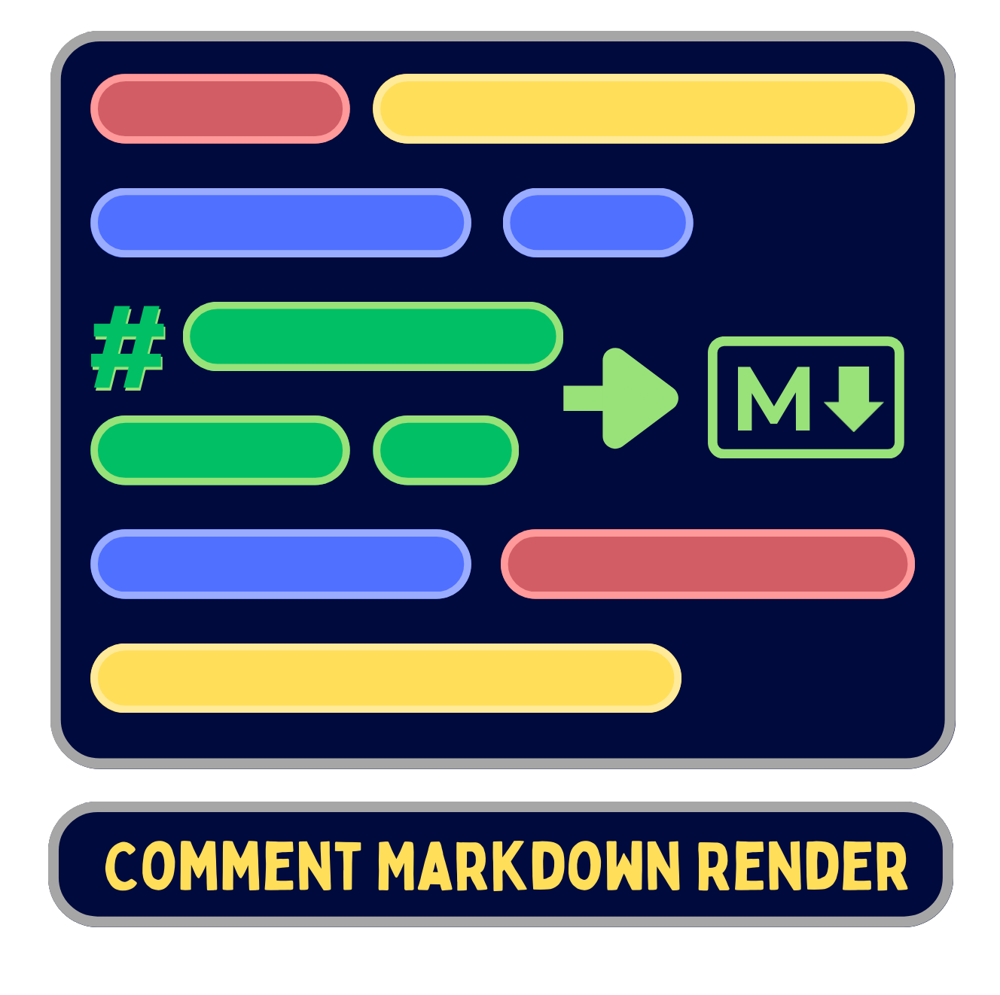
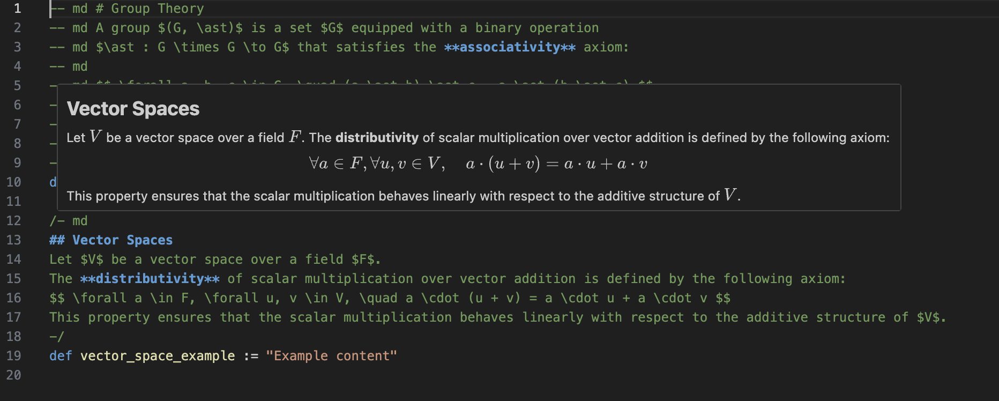

<div align="center">
  
    
  *[Axel Delaval](https://axeldlv00.github.io/axel-delaval-personal-page/) • February 22th 2026*
  <br />

  [](https://github.com/AxelDlv00/comment-markdown-render)
[](./LICENSE)
</div>

# Comment Markdown Render

A Visual Studio Code extension that renders Markdown content directly within code comments, including support for LaTeX math expressions. It handles most common comment styles across various programming languages, including multi-line block comments and stacked single-line comments. 

The original motivation was to be able to code in most languages as in a Jupyter notebook, particularly in Formalization languages (e.g., Lean4) where rendering mathematical formulas is particularly useful. 

## Example 

As shown below, when hovering over a comment block starting with the `md` prefix, the extension renders the Markdown content.

<div align="center">

</div>

## How to Use

To trigger the Markdown rendering, simply start your comment with the `md` prefix.

### Multi-line Blocks

The extension supports standard block comments across most languages:

```javascript
/** md
 * # Documentation
 * This is a **JSDoc** comment with math:
 * $$ \frac{-b \pm \sqrt{b^2-4ac}}{2a} $$
 */
```

```python
""" md
# Python Docstring
You can use *Markdown* here too!
- Item 1
- Item 2
"""
```

### Single-line Comments

You can also stack single-line comments:

```typescript
// md # Title
// md This is a list:
// md 1. First point
// md 2. Second point with $\alpha$
```

## Supported Comment Styles

| Syntax | Languages |
| --- | --- |
| `/* md ... */` or `/** md ... */` | JS, TS, C++, Java, CSS, etc. |
| `""" md ... """` | Python, Julia |
| `''' md ... '''` | Python |
| `/- md ... -/` | Lean4 |
| `// md` | C-style languages |
| `# md` | Python, Ruby, YAML, Bash |
| `-- md` | Lua, Haskell, SQL |